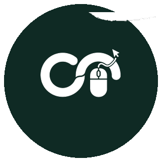

  
  
  

---

### About

Software Engineer with experience in **backend development**, **system automation**, and **large-scale platforms**. I ship secure, scalable products — from university systems to national digital infrastructure.

- Currently building at **CSETech** (Center for Software Development & Emerging Tech)
- Full-stack delivery across product, automation, and data-heavy workflows
- Based in **Dhaka, Bangladesh**

---

### Experience

<table>
<tr>
<td width="18%" align="center" valign="middle">
  
</td>
<td valign="middle">

**Software Engineer** · CSETech  
Center for Software Development & Emerging Tech · [CSE-TECH-DIU](https://github.com/CSE-TECH-DIU)  
Nov 2025 – Present

</td>
</tr>
<tr>
<td width="18%" align="center" valign="middle">
  
</td>
<td valign="middle">

**Full Stack Developer** · Fawz Biz Enterprises  
[fawzbiz-enterprises](https://github.com/fawzbiz-enterprises)  
Jul 2025 – Present

</td>
</tr>
<tr>
<td width="18%" align="center" valign="middle">
  
</td>
<td valign="middle">

**Full Stack Developer** · Office of the Students' Affairs, DIU  
Jun 2024 – Jun 2026

</td>
</tr>
</table>

---

### Featured projects

<table>
<tr>
<td width="50%" align="center" valign="top">
    
  <b>E-Family Court</b> 
  National e-Judiciary platform 
  Ministry of Law, Justice and Parliamentary Affairs 
  <a href="https://efamilycourt.judiciary.gov.bd/">Live project</a>
</td>
<td width="50%" align="center" valign="top">
    
  <b>Student Hub</b> 
  Official DIU student management platform 
  Orientation · Clubs · Payments · Enrollment sync 
  <a href="https://studentshub.daffodilvarsity.edu.bd/">Live project</a>
</td>
</tr>
</table>

---

### Education

<table>
<tr>
<td width="18%" align="center" valign="middle">
  
</td>
<td valign="middle">

**M.Sc. in CSE (Major in Data Science)**  
Daffodil International University · 1 May 2026 – 30 Apr 2028

**BS in Computer Science and Engineering**  
Daffodil International University · Aug 2021 – Aug 2025 · CGPA 3.30

</td>
</tr>
</table>

---

### Organizations

  
  
  
  
  

---

### Capabilities

- Strong scripting & programming across **Laravel / PHP**, **Python**, **Node.js**, and **REST APIs**
- Experience with automation pipelines, background processing patterns, and performance-minded backends
- Ships secure, scalable, reliable application environments (multi-tenant + institutional systems)
- Data integration: MySQL/NoSQL, SQL optimization, scraping & sync engines

  
  
  
  
  
  
  

---

### GitHub pulse

 

 

---

### Contribution graph

### Achievements

Unlocking badges through real pull requests, collaboration, and consistent shipping —  
[see the full achievements board](https://github.com/Shafin5556?tab=achievements).

---

### Connect

  Let’s build something meaningful.  
  <a href="mailto:shafinahmed5556@gmail.com">shafinahmed5556@gmail.com</a> ·
  <a href="https://linkedin.com/in/shafin5556">LinkedIn</a> ·
  <a href="https://github.com/Shafin5556">GitHub</a>

